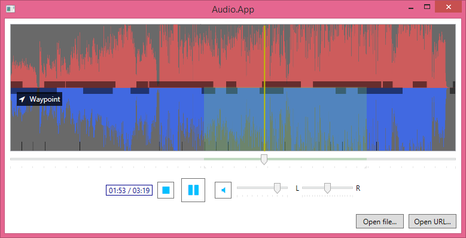

# NWaveform

Audio waveform library for .NET & WPF.

 

Here is a screenshot from the sample application

## Installation

Add the NuGet packages to your WPF application or library. From the Package Manager Console type

    Install-Package NWaveform.WPF

For [VLC](http://www.videolan.org/) support, add

    Install-Package NWaveform.Vlc
